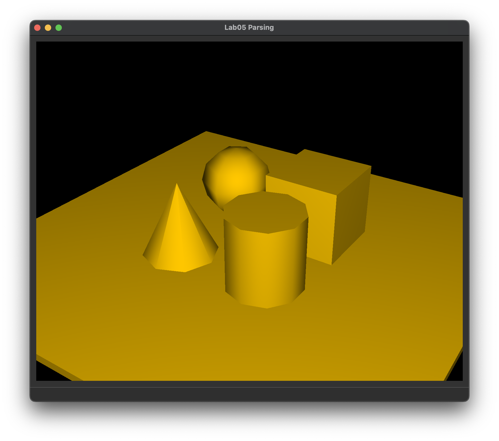
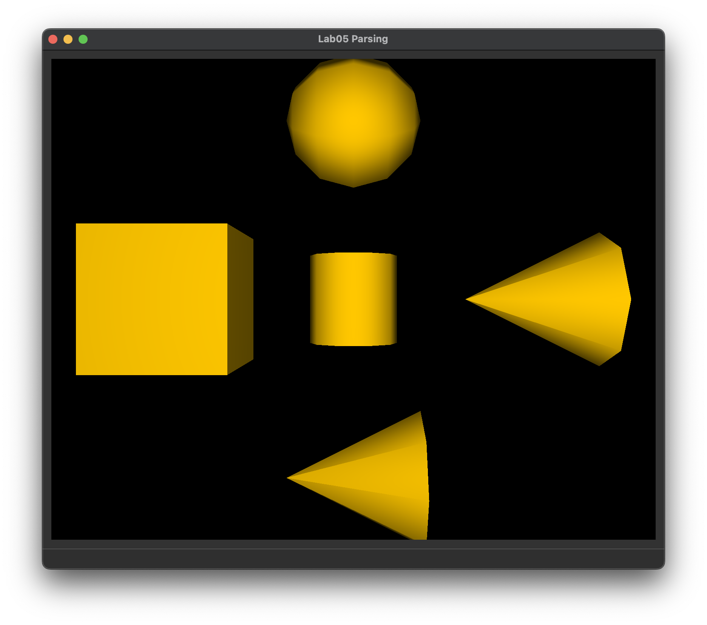
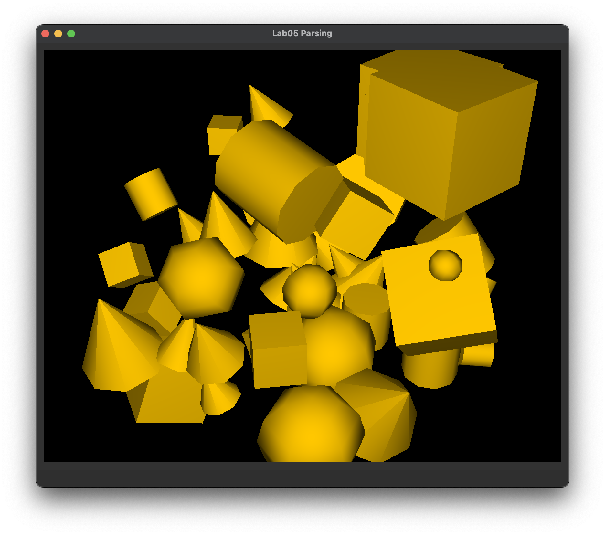

# Lab 3: Transforms and Parsing

### Task 6

Note down what buttons you pressed to match the objects.

- Object 1:
- Object 2:
- Object 3:

### Task 9

_multiply \_\_ and \_\_ to get \_\_ in \_\_\_\_\_\_ space. Then..._

### Task 11

| Scene file               | Expected Output                                        | Student Output                                   |
| :----------------------- | :----------------------------------------------------- | ------------------------------------------------ |
| `directional_light.json` |  |  |
| `ambient_total.json`     |      |      |
| `primitive_salad.json`   |    |    |
